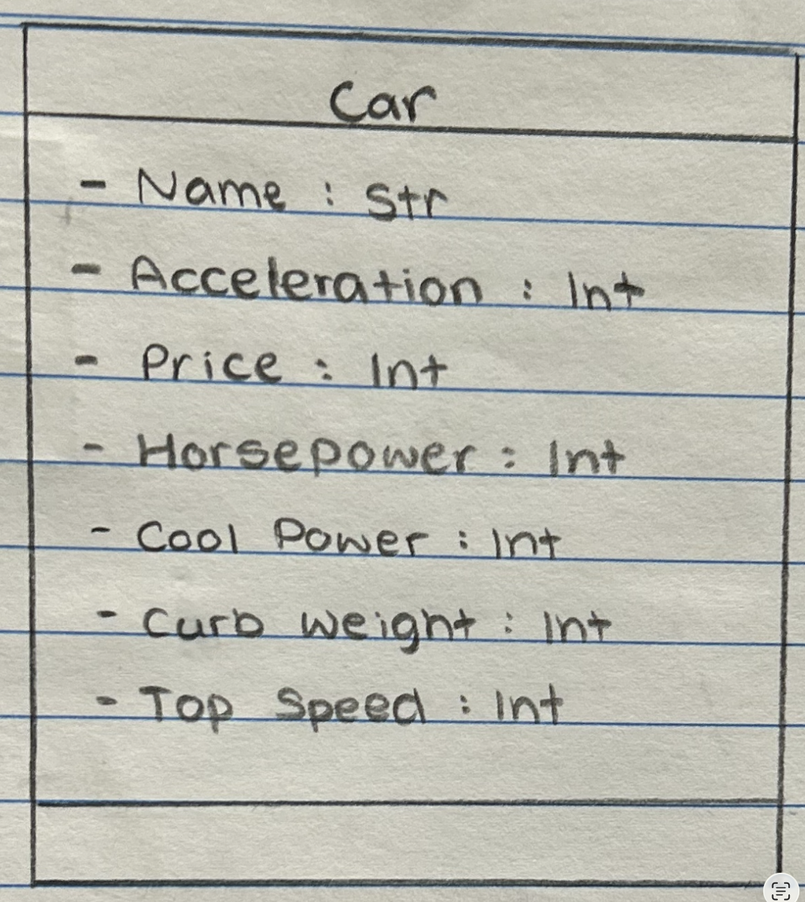
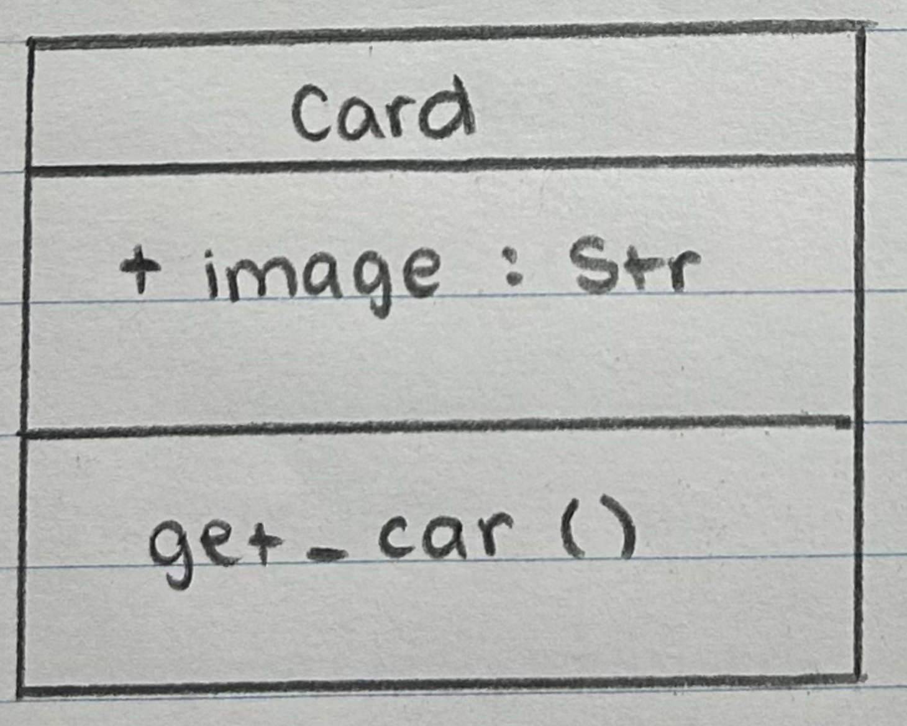
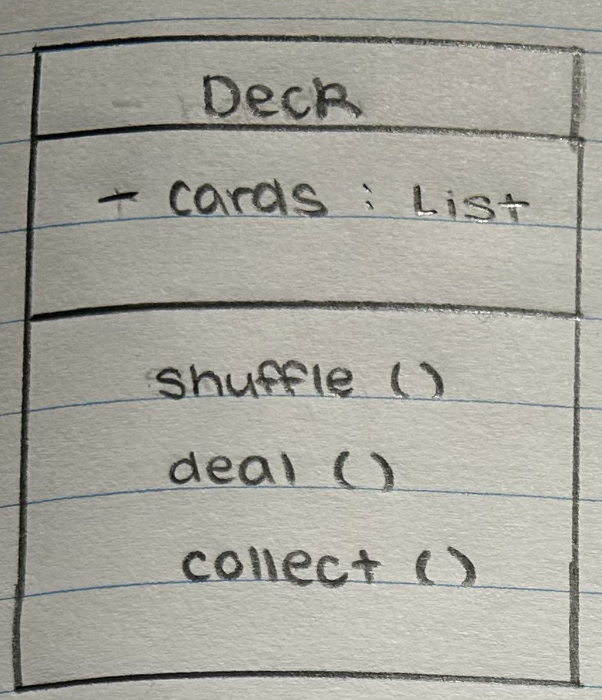
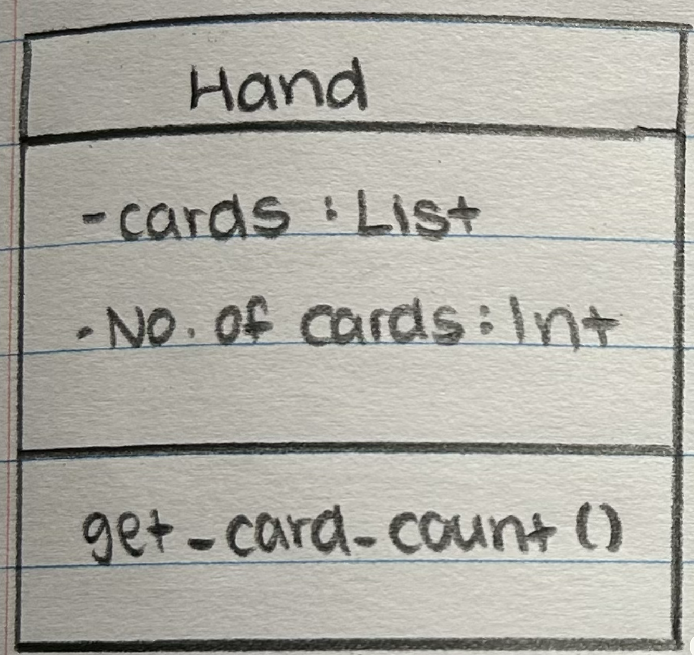
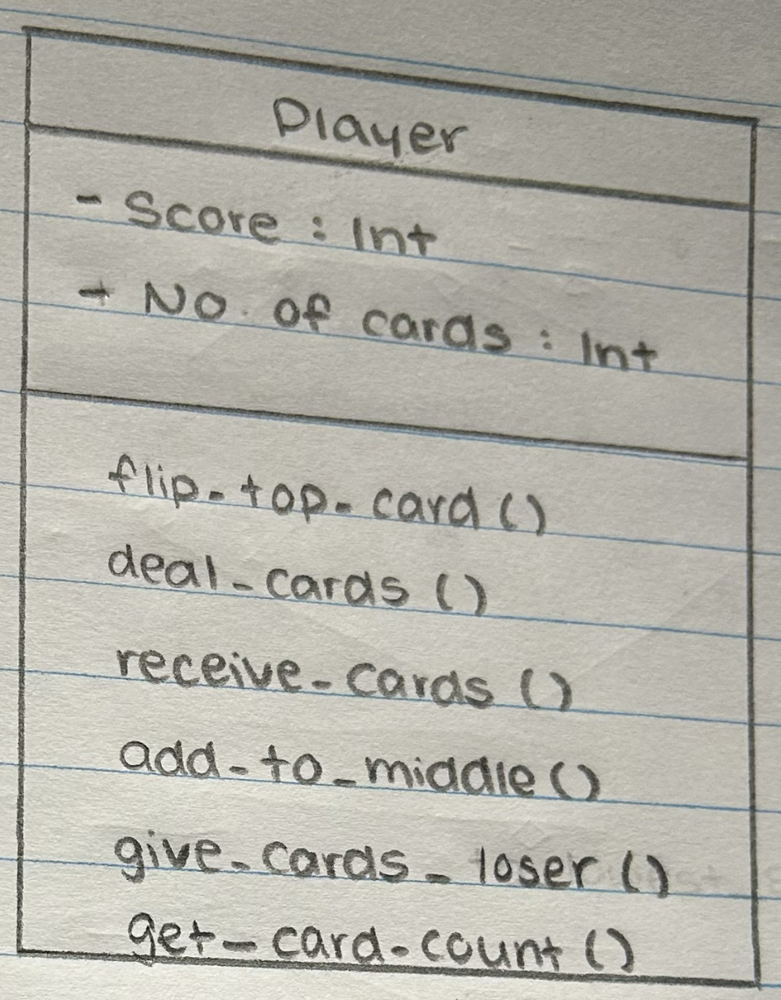
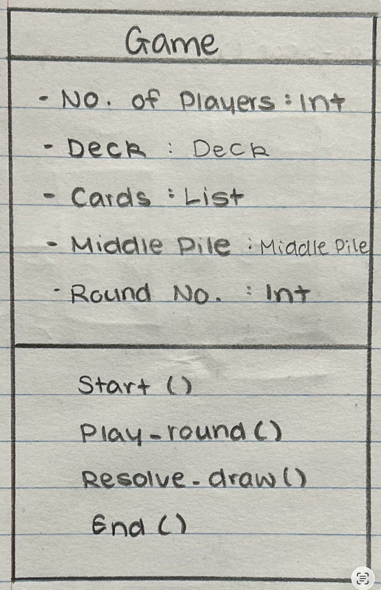
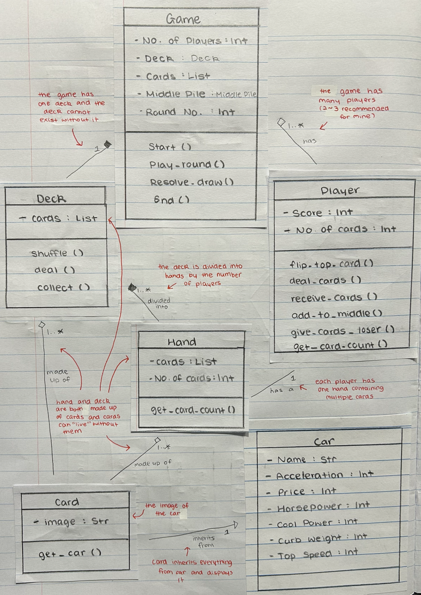
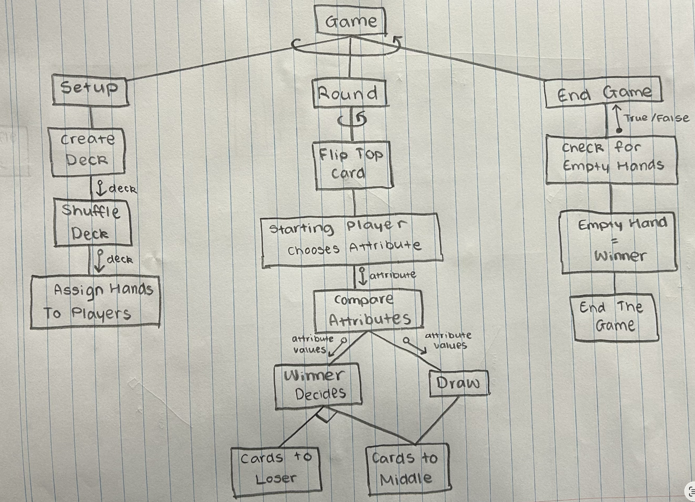
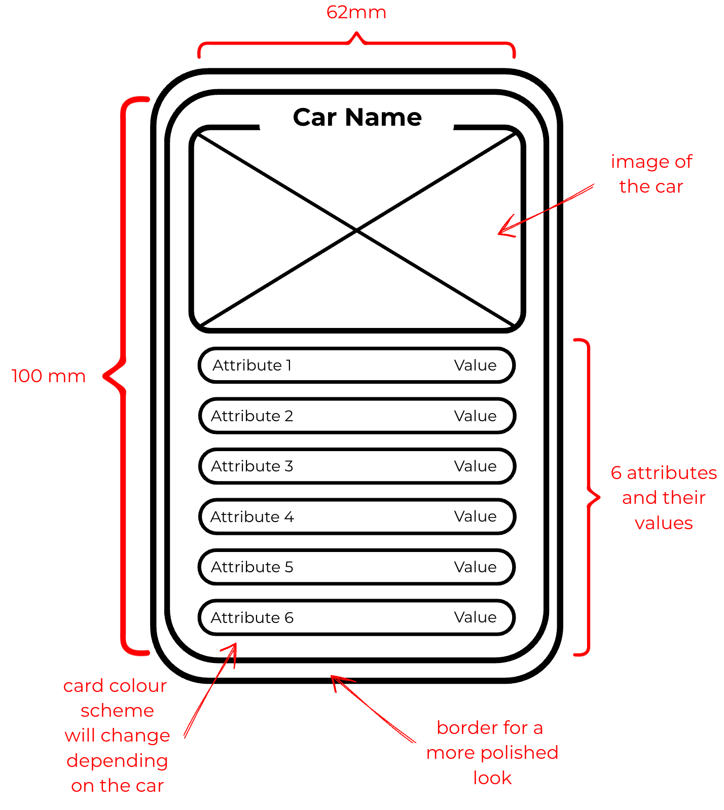
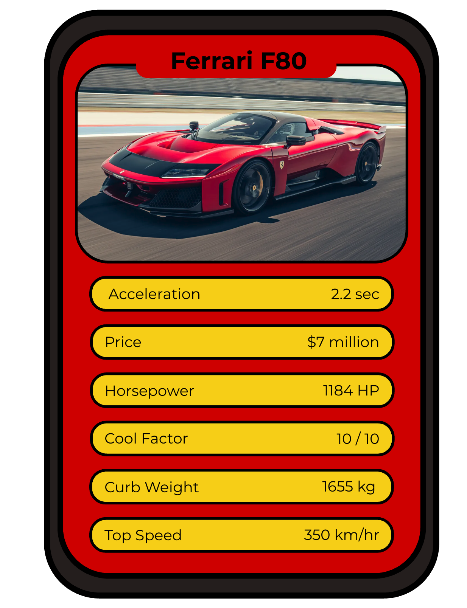

# Assessment Task 2 - Object-Oriented Design Project - Car Comparison Game
Yuna Shin

## Plan
| Step | Why | Expected Result | Time |  
| --- | --- | --- | --- |
| 1. Part D | I will do this first in order to make sure that I know what attributes and classes I will need to create. | The design of my game, something to fix in the future and its appropriate structure chart. | 1 hour |
| 2. Part A | As soon as I have a an idea for my game, I will create my attrubutes and rank them. | My 6 attributes ranked with an explanation for each. | 2 hours |
| 3. Part B | I will design the classes so that I will be able to move onto the next step which will be rearranging them into a UML class diagram. | All my classes listed with their respective attributes, methods and its role in the system. | 2 hours |
| 4. Part C | After all my classes are finished, I will be able to create a UML class diagrams including all the relationships. | A finished UML class diagram. | 1 hour |
| 5. Part E | Now that the classes and their information is all finished and I have the my game set out, I will be able to design the card and the basic interface of my game. | Finished card and interface design with labels and annotations explaining my design choices, clear layout of my information and storyboards or a walk through. | 2 hours |
| 6. Part F | After everything is done, I will be able to write out my social, ethical and legal implications without a problem. | Answered all the questiona of the social, ethical and legal implications. | 3 hours |
| 7. Overall Review | After everything is done, I will need to make sure that my attributes, classes and the interface and card design all match my game. If they don't, I'll will slightly alter my game so that it will be able to match. | ASSESMENT TASK FINISHED !!| 1 hour |

## Part A - Data Selection and Game Attributes
### 1. Acceleration
Acceleration is the most powerful attribute in the game because its range of 0.4 ~ 30 seconds is extremely wide and evenly distributed across many types of cars. This means the difference between the fastest and slowest cards is dramatic, making acceleration a highly decisive attribute when chosen. At first, acceleration might seem unfair since in real life, better cards accelerate faster, meaning a supercar with a 0.4 second time looks unbeatable. However, in the rules, the attribute with the highest number wins, which completely flips the logic. A car with a low price, low horsepower or generally a weak stats will usually has a slow acceleration time, and that slow time gives a higher number, meaning it can actually beat a supercar whose acceleration number is much lower. This makes acceleration both powerful and fair, because even the 'bad' cards have a real chance of winning against the strongest cards. The attribute stays impactful because the range is so large but it remains balanced because weaker card can outperform supercars under the scoring system of my game. 

### 2. Price
Price is the second-most powerful attribute because its range is enormous, as the values stretch from everyday cars to ultra-luxury models worth tens of millions, creating a dramatic difference between the lowest and highest cards. This wide spread makes price an impactful category, since even a small shift in value can completely change the outcome of a round. It was chosen because price is a universally understood measure of a car's status, making it easy for players to grasp its importance. The attribute remains fair because the distribution of prices across the deck ensures that no single card becomes overwhelmingly dominant. The large ranges gives price strong influence, but the natural variation keeps it balance and unpredictable.  

### 3. Horsepower
Horsepower represents the strength of a car's engine, and its values span from very low outputs to extremely powerful machines. This creates meaningful variation between cards, making horsepower an exciting and competitive attribute. It was chosen because it is one of the most recognisable car statistic, giving players a clear sense of the what the numbers represent. The attribute it fair because its range is wide enough to matter but not so extreme that it overshadows other categories. Horsepower influences outcomes in a noticeable but not extreme way, making it a reliable attribute that stays competitive without dominating. 

### 4. Cool Factor
Cool Factor represents the unique flair, personality or iconic appeal of a car, giving the deck a statistic that feels different from traditional performance aspects. Its range is moderate, offering enough variation to create a competition without allowing any card to dominate, and it satys especially balanced as even older or weaker cars can score surprisingly high thanks to classic styling, nostalgic charm or a favourite status. This means decade-old models can genuinly outperform a modern supercar in this category, keeping rounds predictable and fair. Cool Factor was chosen to add creativity to the game, and its controlled spread combined with the fact that any car can be cool for different reasons ensures that the game remains fun and competitive.

### 5. Curb Weight
Curb Weight reflects how heavy a vehicle is, with values ranging from very lightweight models to much heavier ones. The range is noticeable but not extreme, which makes Curb Weight a more moderate and steady attribute. It was chosen because weight is a classic and realistic car statistic that fits naturally into a card‑based system. The attribute remains fair because its narrower spread prevents any card from gaining an overwhelming advantage, and the outcomes tend to be closer and more suspenseful. Curb Weight adds variety while maintaining balanced gameplay.

### 6. Top Speed
Top Speed is the least powerful attribute because its values fall within a relatively tight range, with most cars reaching similar maximum speeds. This limited spread means that rounds decided by top speed are often close, with smaller differences between cards. It was chosen because top speed is one of the most iconic and easily recognized car statistics, making it a natural fit for the deck. The attribute is fair because no card gains a massive advantage from it, and the narrow range keeps outcomes unpredictable. Top Speed adds familiarity and excitement without dominating the overall balance.

## Part B - Class Design
### Car
The *Car* class represents the raw data for a vehicle, storing all attribute values used during comparisons. It acts as the foundational blueprint that all cars are built from.   

### Card
The *Card* class turns a *Car* into a playable game piece by presenting its attributes for use in each round. It serves as the object players draw, flip and compare.   

### Deck
The *Deck* class manages the full collection of cards, handling shuffling, dealing and any shared piles. It ensures randomness and proper setup for the game.  

### Hand 
The *Hand* class represents the collection of cards a player currently holds after the deck is divided. It manages drawing, removing and adding cards during gameplay, acting as the player's active pile.   

### Player
The *Player* class represents a participant and stores their personal pile of cards. It performs actions such as flipping cards, choosing attributes and receiving lost cards.   

### Game
The *Game* class controls the overall flow, enforcing rules, managing turns, resolving rounds and determining when the game ends. It coordinates all other classes to run the gameplay loop.   

## Part C - Class Diagram

## Part D - Game Mechanics Design
### How the game works :
1. All players (recommended 2~3) receive an equal pile of cards
2. The player to the left of the dealer goes first
3. Everyone flips over the top card of their pile
4. The starting player chooses the biggest attribute on their card and calls it out
5. All players read out their number for that same attribute
6. The player with the highest attribute value wins the round
7. They collect all the cards played in that round but must choose on of the two actions :
    - Add the cards to the middle pile 
    - Give the cards to the lowest scoring player
8. Then the next player on the left side of the previous starting player calls out their highest attribute
9. Again, the player with the highest attribute value wins that round
10. They collect all the cards played in that round and have a similar two options like the player before :
    - Add the cards to the middle pile
    - Give the cards, including the pile in the middle, to the lowest scoring player
11. The first person to lose all their cards wins

In the case of a draw :
A draw can occur in two cases. Either two players tie for the highest attribute or tie for the lowest attribute. In these cases, all the cards played in that round automatically go into the middle pile. 

Middle Pile (easier to understand) :
If the winner of that round chooses to add cards to the middle, the pile stays untouched until the next round's winner decides. They can either add the new round's cards to the pile again or give the entire pile including the round's cards to the lowest-scoring player. 

### Game Balance
There are many aspects in which my game is balanced including :
- Equal starting conditions (everyone beings with the same number of cards)
- Equal opportunity (everyone gets turns choosing an attribute)
- Unpredicatbility (the middle pile can go to anyone at anytime)
- Emotional tension (players feel excitement and fear as the pile grows)
- Late-game swings (even players close to winning can suddenly receive the pile)

### An Unfair Advantage + Solution
Players can intentionally target a player by continuously stakcing the cards in the middle pile, waiting until the end of the game the dumping the entire pile onto one chosen player. 

This could be fixed with a shield card that can prevent a player from receving the pile. A player may activate a shield when they are about to receive the pile but it comes with a cost. This might be :
- Taking one extra card from every player
- Losing the ability to add to the pile for the next two rounds

### Structure Chart

## Part E - Interface and Car Design ( storyboards )
Create :
- A card design (Top Trumps style)
- Basic game interface sketch

Must include :
- Labels and annotations explaining design choices
- Clear layout of information
- Storyboards and/or walk through

### Card Design - Wireframe

### Card Design - Example

### Storyboard 

## Part F - Social, Ethical and Legal Implications
### Individual Impact
**How could you game influence user behaviour or decision-making?**
My game can influence user behaviour by encouraging players to compare numbers, balance risks and make quick strategic decisions. Over time, this strengthens skills like pattern recognition, probability thinking and decision-making under pressure. 

**Could it encourage bias (e.g. favouring expensive or high-performance cars)?**
As high-value attributes often win rounds, the game may unintentionally make players view expensive or high-performance cars as "better". However, the attributes of acceleration and cool factor help balance this out, since even older or less powerful cars can score higher in these areas. 

**What responsibilities do you have as a designer to present fair information?**
As a designer, I am responsible for presenting information that is accurate and not misleading. To support this, all attributes will be correct, well-sourced and clearly presented so every card is fair within the game.

### Social Impact
**How might your game reinforce stereotypes or inequalities (e.g. wealth, status, access to vehicles)?**
My game might reinforce social inequalities by making luxury or high-status cars seem more desirable because they simply have larger numbers. This can unintentionally mirror real-word hierarchies around wealth and access to vehicles. 

**Does your system favour certain types of users or cars?**
My system could favour players who draw extreme-value cards, giving them more opporutinities to win rounds. This also highlights high-performance vehicles more prominently than everyday or practical ones. However, they are mainly balanced out by the attributes that favour slower acceleration time or by aesthetics. 

**How could your design be made more inclusive or fair?**
The design could be made more inclusive and fair by adding attributes that reflect everyday concerns like safety, reliability or accessibility. Including a larger range of vehicles (so more cards) and giving more unique davantages to low-performance cards could help create a more balanced experience. 

### Environmental Impact
**How could your game influence attitudes toward fuel use, emissions or sustainability?**
My game could influence attributes toward sustainability by prompting players to think about how attributes like horsepower relate to fuel use and emissions. Additonally, including electric cars could also spark curiosity about environmental impacts, even if the game doesn't mention it directly. 

**Does your attribute selection promote or ignore environmental considerations?** 
My current attribute selection focuses mainly on performance and cost, which means that environmental considerations like emissions, fuel efficiency or electric range are not promoted and mainly ignored.

**What changes could you make to encourage more environmentally responsible thinking?**
I could encourage environmentally responsible thinking by adding attributes such as CO2 emmissions, fuel efficiency or carbon footprint. Other rules that I could consider are rewarding low-emission vehicles, which could help players recognise sustainability.

### Legal Considerations
**What legal issues could arise from using real-world car data (e.g. ownership, copyright, accuracy)?**
Legal issues could arise from using real-word car names, images or statistics because they are often protected by copyright or trademarks. Inaccurate data could also create problems with brand representation, expecially for famous companies.

**How would you ensure your system avoids misleading users?**
I could avoid misleading users by using original photos, verifying all data and including a disclaimer that the statistics are simplified for a smoother gameplay. 